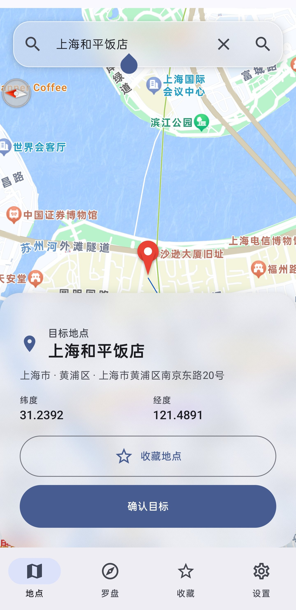
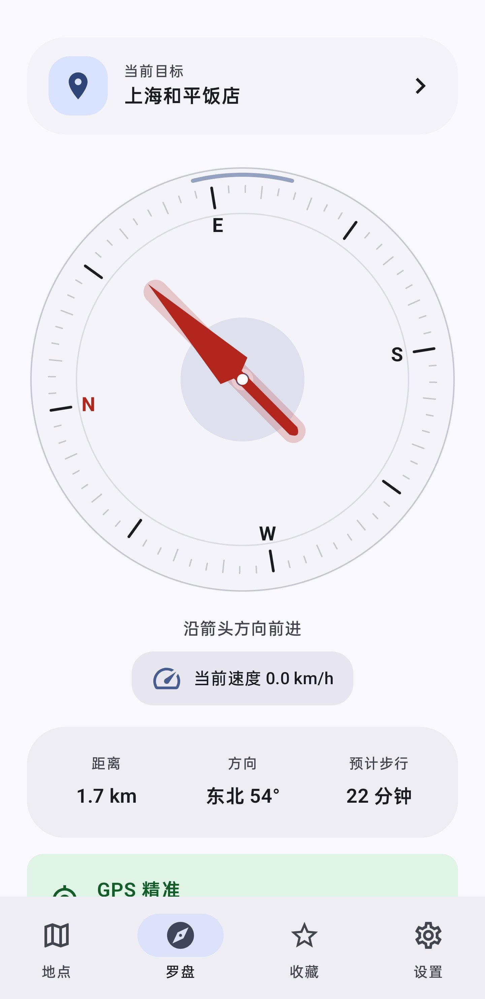

# Destination Compass（目的地罗盘）

使用 Kotlin、Jetpack Compose 与 Material Design 3 构建的 Android 目的地方向工具。

## 应用截图

<p align="center">
  
  
</p>

## 已实现

- 百度地图 Android SDK 地图选点、POI 搜索与反向地理编码
- 百度定位 Android SDK 9.6.8 高精度混合定位（GNSS + Wi-Fi + 基站）
- 移动时按用户设置高频更新，连续静止后自动降至 5000ms
- 设置页通过滑块选择 500–5000ms，步进 100ms
- GCJ-02 坐标统一，避免定位坐标被重复转换造成偏移
- 位置卡尔曼滤波、异常跳点过滤与低速漂移抑制
- 地图定位箭头插值移动、最短角旋转、中心跟随和车头朝上模式
- 地点页使用高对比度细线实时连接用户位置与目的地
- 地点页记忆中心跟随状态，搜索结果选中后自动退出跟随并定位目的地
- 地点页 50 米接近、10 米到达提示，并避免重复状态栏留白
- 罗盘页实时显示当前速度（km/h）
- 地点页与罗盘页均提供 50 米接近、10 米到达提示
- 目标详情可直接收藏或取消收藏地点，新安装默认收藏列表为空
- `TYPE_ROTATION_VECTOR` 融合方向检测与 spring 罗盘指针动画
- Material You 动态颜色、浅色/深色主题、地点详情 Bottom Sheet
- DataStore 持久化目标、收藏、主题、单位和定位刷新率

> 百度定位 SDK 的周期定位下限约为 1000ms。滑块可选择 500–900ms，应用会以 1000ms 获取定位，并保持 Marker 连续动画。

## 架构

```text
data/
  database/    DataStore 持久化
  location/    百度定位 SDK、LocationState、位置滤波
  map/         百度 POI、地理编码与地图选点
  network/     网络状态监听
domain/
  BearingCalculator.kt
  CompassProcessor.kt
presentation/
  CompassScreen.kt
  MapPickerScreen.kt
  MainViewModel.kt
sensor/
  CompassSensorManager.kt
  CompassState.kt
```

## 配置百度地图

在项目根目录的 `local.properties` 中配置：

```properties
BAIDU_MAP_API_KEY=你的百度地图 Android SDK AK
```

百度开放平台中登记的包名：

```text
com.destinationcompass.app
```

## 构建与测试

```powershell
.\gradlew.bat testDebugUnitTest assembleDebug
```

APK 输出：`app/build/outputs/apk/debug/app-debug.apk`
